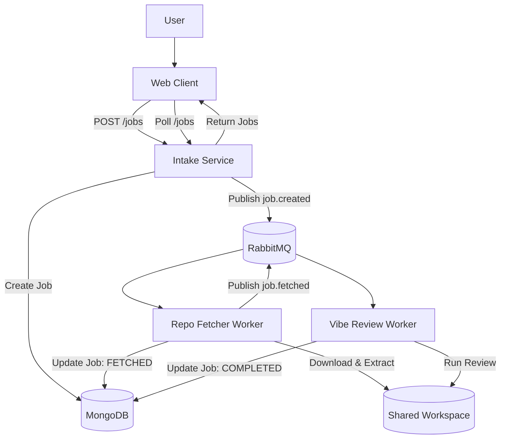

# RepoLens

GitHub repo scan platform that ingests a GitHub URL, fetches the repository archive, runs a review workflow, and surfaces results in a web UI.

**Project Overview**
- User submits a GitHub repo URL in the web client.
- Intake service validates the URL, creates a job in MongoDB, and publishes a `job.created` message.
- Repo Fetcher downloads and extracts the repo into a shared workspace, updates the job to `FETCHED`, and publishes `job.fetched`.
- Vibe Review service loads repository files, asks Codex review prompts, stores results on the job, and marks the job `COMPLETED` (or `FAILED`).
- Web client polls for jobs and renders review results.

**Architecture**
- `apps/web-client` (Vite + React) polls the intake API.
- `apps/intake-service` (Express) exposes HTTP endpoints and publishes RabbitMQ messages.
- `apps/repo-fetcher-service` (worker) consumes `job.created`, fetches and extracts repos, and publishes `job.fetched`.
- `apps/vibe-review-service` (worker) consumes `job.fetched` and generates/stores review results.
- Shared MongoDB stores job state; RabbitMQ is the service bus; a shared volume holds fetched repos.

**Tech Stack**
- React + Vite: UI, polling, and review display.
- Express: intake API endpoints.
- MongoDB + Mongoose: job persistence.
- RabbitMQ (amqplib): async job pipeline.
- Node.js + TypeScript: runtime + static typing across services.
- Pino: structured JSON logging.
- Docker + Docker Compose: local orchestration.
- Kubernetes manifests + KEDA: deployment and autoscaling examples.

**Prerequisites**
- Node.js 20+ and `pnpm` 9+
- Docker (for local stack)
- MongoDB + RabbitMQ (provided by Compose or your own infrastructure)

**Setup**
1. Install dependencies:
```bash
pnpm install
```

2. Create local env files (edit values as needed):
```bash
copy .env.example .env
copy apps\intake-service\.env.example apps\intake-service\.env
copy apps\repo-fetcher-service\.env.example apps\repo-fetcher-service\.env
copy apps\vibe-review-service\.env.example apps\vibe-review-service\.env
copy apps\web-client\.env.example apps\web-client\.env
```

**Run**
- Docker Compose (recommended local dev):
```bash
pnpm dev:compose
```
- Access UI at `http://localhost:5174` (Compose maps `5174 -> 5173`).
- Intake API at `http://localhost:3001`.

**Configuration**
Root and service-level `.env` files control runtime. These are the variables used in code:
- `PORT` (intake-service): HTTP port. Default `3001`.
- `MONGODB_URI`: MongoDB connection string.
- `RABBITMQ_URL`: RabbitMQ connection string.
- `WORKSPACES_ROOT`: shared directory for repo extraction. Default `/workspaces`.
- `LOG_LEVEL`: logging level (e.g., `info`, `debug`).
- `ZIP_SIZE_LIMIT_MB`: max archive size before aborting (repo-fetcher).
- `ZIP_FILE_COUNT_LIMIT`: max number of extracted files (repo-fetcher).
- `DOWNLOAD_TIMEOUT_MS`: download timeout in ms (repo-fetcher).
- `EXTRACT_TIMEOUT_MS`: extraction timeout in ms (repo-fetcher).
- `REVIEW_TIMEOUT_MS`: review timeout in ms (vibe-review).
- `REVIEW_USE_CODEX`: enable Codex-backed review (`true`/`false`, default `true`).
- `REVIEW_MODEL`: model name used by the review worker (default `codex-mini-latest`).
- `REVIEW_MAX_CONTEXT_CHARS`: max characters of repo content sent to Codex per question.
- `REVIEW_MAX_FILE_CHARS`: max characters per file included in the Codex prompt.
- `SCAN_INCLUDE_DEPRIORITIZED`: include lower-priority roots like `docs/`, `tests/`, `examples/` in scan pass 2 (default `false`).
- `OPENAI_API_KEY`: API key used by the review worker to call Codex.
- `VITE_API_BASE_URL`: web client API base URL.

**API (Intake Service)**
- `GET /health`
  - Response: `{ "status": "ok" }`
- `POST /jobs`
  - Body: `{ "repoUrl": "https://github.com/org/repo" }`
  - Response: `{ "jobId": "<id>", "status": "QUEUED" }`
- `GET /jobs`
  - Query: `status` (optional)
  - Response: `Job[]`
- `GET /jobs/:id`
  - Response: `Job`

`Job` shape (stored in MongoDB, returned by API):
```json
{
  "_id": "string",
  "repoUrl": "string",
  "status": "QUEUED|FETCHING|FETCHED|REVIEWING|COMPLETED|FAILED",
  "localPath": "string|null",
  "reviewResults": { "questions": [] } ,
  "error": "string|null",
  "createdAt": "ISO string",
  "updatedAt": "ISO string"
}
```

**Project Flow**


**K8s Local (kind/minikube)**
1. Build and load images:
```bash
docker build -t repolens/intake-service:local -f apps/intake-service/Dockerfile .
docker build -t repolens/repo-fetcher-service:local -f apps/repo-fetcher-service/Dockerfile .
docker build -t repolens/vibe-review-service:local -f apps/vibe-review-service/Dockerfile .
docker build -t repolens/web-client:local -f apps/web-client/Dockerfile .
```

If using kind:
```bash
kind load docker-image repolens/intake-service:local
kind load docker-image repolens/repo-fetcher-service:local
kind load docker-image repolens/vibe-review-service:local
kind load docker-image repolens/web-client:local
```

2. Apply manifests:
```bash
./scripts/k8s-up.sh
```

3. Tear down:
```bash
./scripts/k8s-down.sh
```

**User Guide (Installation & Usage)**
See `docs/USER_GUIDE.md` for the full installation, configuration, and end-to-end usage guide.

**License**
TBD

**Contributing**
TBD
