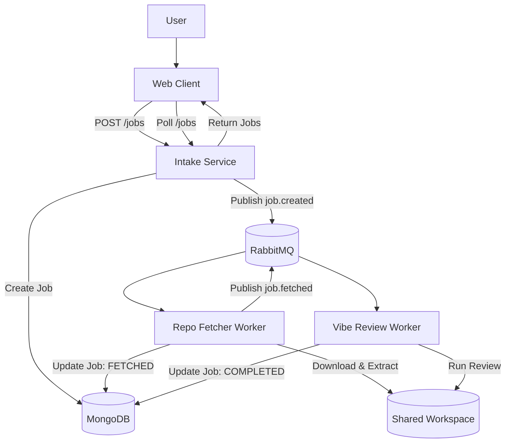

# RepoLens

**Automated GitHub Repository Analysis Platform**

RepoLens is a self-hosted platform that performs automated code reviews on any public GitHub repository. Submit a repo URL, and the system fetches the source, runs an AI-powered analysis pipeline using OpenAI Codex, and delivers structured findings — including risk scoring, best-practice violations, and actionable improvement suggestions — all accessible through a real-time web dashboard.

## Key Features

- **One-click analysis** — paste a GitHub URL and get a full review without any repo setup.
- **AI-powered review engine** — leverages OpenAI Codex to evaluate code quality, security patterns, and architecture.
- **Async job pipeline** — RabbitMQ-driven microservice architecture ensures jobs are processed reliably at scale.
- **Real-time status tracking** — web UI polls for live progress updates from queued → fetching → reviewing → completed.
- **Configurable scanning** — control file size limits, extraction timeouts, model selection, and context windows.
- **Production-ready infrastructure** — ships with Docker Compose for local dev and Kubernetes manifests with KEDA autoscaling for deployment.

## Architecture

```
┌────────────┐     POST /jobs     ┌─────────────────┐
│ Web Client │ ──────────────────▶│ Intake Service   │
│ (React)    │◀── Poll /jobs ─────│ (Express API)    │
└────────────┘                    └────────┬─────────┘
                                           │ job.created
                                    ┌──────▼──────┐
                                    │  RabbitMQ   │
                                    └──┬───────┬──┘
                              job.created│     │job.fetched
                                 ┌───────▼─┐ ┌─▼──────────────┐
                                 │ Repo     │ │ Vibe Review    │
                                 │ Fetcher  │ │ Service        │
                                 └────┬─────┘ └───────┬────────┘
                                      │               │
                                 ┌────▼───────────────▼────┐
                                 │       MongoDB           │
                                 │    (Job persistence)    │
                                 └─────────────────────────┘
```

| Service | Role |
|---|---|
| **web-client** | React + Vite SPA. Submits jobs and polls for results. |
| **intake-service** | Express API. Validates URLs, creates jobs in MongoDB, publishes `job.created`. |
| **repo-fetcher-service** | Worker. Downloads and extracts repo archives, publishes `job.fetched`. |
| **vibe-review-service** | Worker. Runs AI-powered code review via Codex, stores results, marks job `COMPLETED`. |

## Tech Stack

| Layer | Technology |
|---|---|
| Frontend | React, Vite, TypeScript |
| API | Express, Node.js |
| Database | MongoDB, Mongoose |
| Message Bus | RabbitMQ (amqplib) |
| AI Engine | OpenAI Codex API |
| Logging | Pino (structured JSON) |
| Infra | Docker Compose, Kubernetes, KEDA |

## Prerequisites

- **Node.js** 20+
- **pnpm** 9+
- **Docker** and **Docker Compose** (for local stack)
- **OpenAI API key** (for AI-powered reviews)

## Getting Started

### 1. Clone and install

```bash
git clone https://github.com/your-org/repolens.git
cd repolens
pnpm install
```

### 2. Configure environment

```bash
# Docker Compose env (required)
copy infra\docker\.env.example infra\docker\.env

# Service-level env files (if running outside Docker)
copy apps\intake-service\.env.example apps\intake-service\.env
copy apps\repo-fetcher-service\.env.example apps\repo-fetcher-service\.env
copy apps\vibe-review-service\.env.example apps\vibe-review-service\.env
copy apps\web-client\.env.example apps\web-client\.env
```

Edit each `.env` file and set your real values — at minimum `OPENAI_API_KEY` and `RABBITMQ_PASS`.

### 3. Run with Docker Compose (recommended)

```bash
# Start all services (foreground with logs)
pnpm dev:compose

# Or start in background
pnpm dev:compose:up

# Stop all services
pnpm dev:compose:down
```

- Web UI: `http://localhost:5174`
- Intake API: `http://localhost:3001`
- RabbitMQ Management: `http://localhost:15672`

## Configuration

Root and service-level `.env` files control runtime. Secrets are marked with a lock icon.

**Secrets** (never commit these):
| Variable | Service | Description |
|---|---|---|
| `OPENAI_API_KEY` 🔒 | vibe-review | API key for OpenAI Codex calls |
| `GITHUB_TOKEN` 🔒 | repo-fetcher | GitHub personal access token for private repos / rate limits |
| `RABBITMQ_PASS` 🔒 | infra (docker-compose) | RabbitMQ password |

**General:**
| Variable | Service | Default | Description |
|---|---|---|---|
| `PORT` | intake | `3001` | HTTP port |
| `HEALTH_PORT` | repo-fetcher, vibe-review | — | Health endpoint port |
| `MONGODB_URI` | all backends | — | MongoDB connection string |
| `RABBITMQ_URL` | all backends | — | RabbitMQ connection string |
| `RABBITMQ_USER` | infra | `repolens` | RabbitMQ username |
| `WORKSPACES_ROOT` | repo-fetcher | `/workspaces` | Shared directory for repo extraction |
| `LOG_LEVEL` | all backends | `info` | Logging level (`debug`, `info`, `warn`, `error`) |
| `START_RETRY_DELAY_MS` | all backends | `5000` | Delay before retrying startup connections |
| `MAX_RETRIES` | repo-fetcher, vibe-review | — | Max message retry attempts |
| `RETRY_TTL_MS` | repo-fetcher, vibe-review | — | Retry delay between attempts |

**Repo Fetcher:**
| Variable | Default | Description |
|---|---|---|
| `ZIP_SIZE_LIMIT_MB` | `200` | Max archive size before aborting |
| `ZIP_FILE_COUNT_LIMIT` | `50000` | Max number of extracted files |
| `DOWNLOAD_TIMEOUT_MS` | `300000` | Download timeout (ms) |
| `EXTRACT_TIMEOUT_MS` | `300000` | Extraction timeout (ms) |
| `CLONE_TIMEOUT_MS` | — | Git clone timeout (ms) |

**Vibe Review:**
| Variable | Default | Description |
|---|---|---|
| `REVIEW_TIMEOUT_MS` | `600000` | Review timeout (ms) |
| `REVIEW_USE_CODEX` | `true` | Enable Codex-backed review |
| `REVIEW_MODEL` | `codex-mini-latest` | Model name for the review worker |
| `REVIEW_MAX_CONTEXT_CHARS` | `180000` | Max characters of repo content per question |
| `REVIEW_MAX_FILE_CHARS` | `4000` | Max characters per file in the Codex prompt |
| `OPENAI_MAX_FINDINGS` | — | Max findings returned per review |
| `OPENAI_MAX_EVIDENCE_CHARS` | — | Max evidence characters per finding |
| `SCAN_INCLUDE_DEPRIORITIZED` | `false` | Include `docs/`, `tests/`, `examples/` in scan |

**Web Client (Vite):**
| Variable | Description |
|---|---|
| `VITE_API_BASE_URL` | Intake API base URL |
| `VITE_INTAKE_HEALTH_URL` | Intake health endpoint URL |
| `VITE_FETCHER_HEALTH_URL` | Repo-fetcher health endpoint URL |
| `VITE_REVIEWER_HEALTH_URL` | Vibe-review health endpoint URL |

## API (Intake Service)
- `GET /health`
  - Response: `{ "status": "ok" }`
- `POST /jobs`
  - Body: `{ "repoUrl": "https://github.com/org/repo" }`
  - Response: `{ "jobId": "<id>", "status": "QUEUED" }`
- `GET /jobs`
  - Query: `status` (optional)
  - Response: `Job[]`
- `GET /jobs/:id`
  - Response: `Job`

`Job` shape (stored in MongoDB, returned by API):
```json
{
  "_id": "string",
  "repoUrl": "string",
  "status": "QUEUED|FETCHING|FETCHED|REVIEWING|COMPLETED|FAILED",
  "localPath": "string|null",
  "reviewResults": { "questions": [] } ,
  "error": "string|null",
  "createdAt": "ISO string",
  "updatedAt": "ISO string"
}
```

## Project Flow


## K8s Local (kind/minikube)
1. Build and load images:
```bash
docker build -t repolens/intake-service:local -f apps/intake-service/Dockerfile .
docker build -t repolens/repo-fetcher-service:local -f apps/repo-fetcher-service/Dockerfile .
docker build -t repolens/vibe-review-service:local -f apps/vibe-review-service/Dockerfile .
docker build -t repolens/web-client:local -f apps/web-client/Dockerfile .
```

If using kind:
```bash
kind load docker-image repolens/intake-service:local
kind load docker-image repolens/repo-fetcher-service:local
kind load docker-image repolens/vibe-review-service:local
kind load docker-image repolens/web-client:local
```

2. Apply manifests:
```bash
./scripts/k8s-up.sh
```

3. Tear down:
```bash
./scripts/k8s-down.sh
```

## User Guide
See `docs/USER_GUIDE.md` for the full installation, configuration, and end-to-end usage guide.

## License

TBD

## Contributing

TBD
